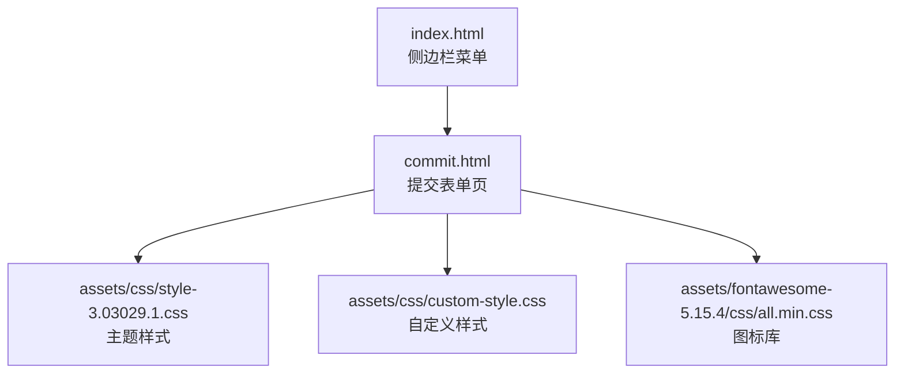
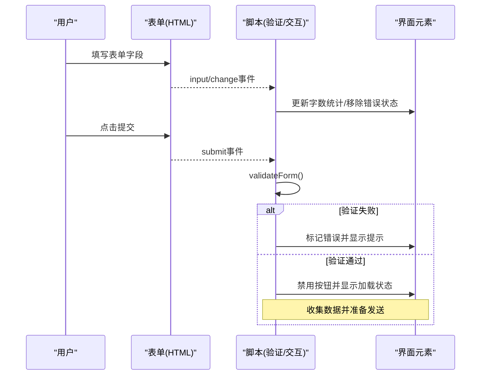
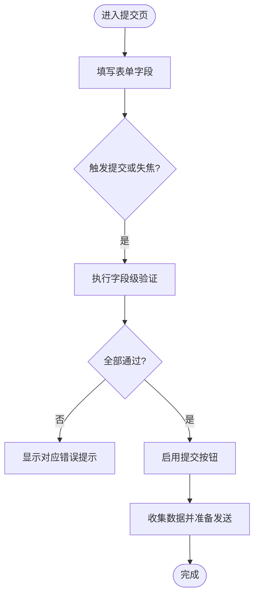
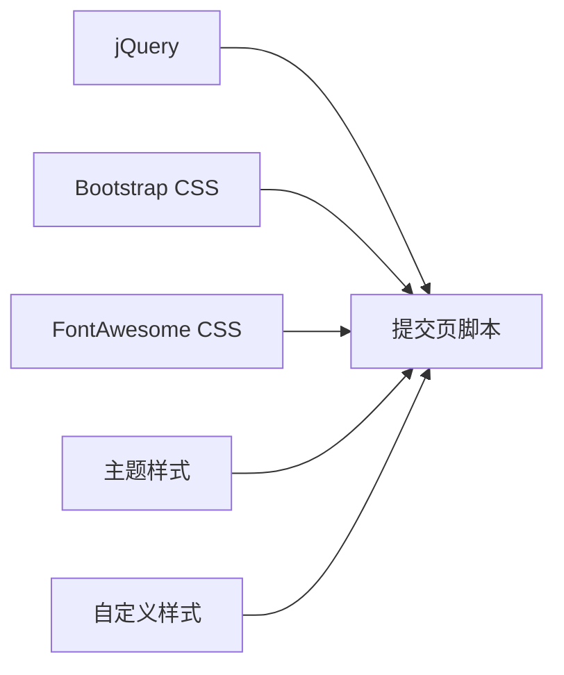

# 提交页面

<cite>
**本文引用的文件**
- [commit.html](file://commit.html)
- [custom-style.css](file://assets/css/custom-style.css)
- [style-3.03029.1.css](file://assets/css/style-3.03029.1.css)
- [index.html](file://index.html)
</cite>

## 目录
1. [简介](#简介)
2. [项目结构](#项目结构)
3. [核心组件](#核心组件)
4. [架构总览](#架构总览)
5. [详细组件分析](#详细组件分析)
6. [依赖关系分析](#依赖关系分析)
7. [性能考量](#性能考量)
8. [故障排查指南](#故障排查指南)
9. [结论](#结论)
10. [附录](#附录)

## 简介
本文件针对“提交页面”（commit.html）进行系统化文档化，聚焦用户提交新网站的表单页面设计与实现。内容涵盖：
- 表单结构与字段设计思路
- 前端验证逻辑、数据格式检查与错误提示机制
- 用户体验优化（实时反馈、友好提示、成功状态展示）
- 安全性考虑（输入过滤、XSS防护、CSRF保护等）
- 表单定制指导（新增字段、修改规则、调整样式主题）
- 移动端适配与可访问性优化最佳实践

## 项目结构
提交页面为独立静态HTML文件，内联样式与脚本，依赖Bootstrap、FontAwesome以及站点通用样式。导航入口位于首页侧边栏的“网站提交”菜单项。

图表来源
- [index.html:191-196](file://index.html#L191-L196)
- [commit.html:15-25](file://commit.html#L15-L25)

章节来源
- [index.html:191-196](file://index.html#L191-L196)
- [commit.html:15-25](file://commit.html#L15-L25)

## 核心组件
- 表单容器与头部：包含标题、说明与提交须知
- 表单字段：网站名称、网站地址、分类、描述、关键词、联系邮箱、联系方式
- 交互脚本：字数统计、表单验证、提交按钮状态切换、错误提示显示/隐藏
- 成功消息：提交成功后展示提示区域

章节来源
- [commit.html:179-283](file://commit.html#L179-L283)
- [commit.html:285-379](file://commit.html#L285-L379)

## 架构总览
提交页面采用“单页表单 + 内联脚本”的轻量架构：
- HTML负责结构与语义
- CSS负责布局与视觉反馈（焦点态、错误态、禁用态）
- jQuery脚本负责事件绑定、验证与UI状态更新
- 通过Bootstrap栅格与类名保证响应式布局
- FontAwesome提供图标增强可读性

图表来源
- [commit.html:285-379](file://commit.html#L285-L379)

## 详细组件分析

### 表单结构与字段设计
- 必填字段：网站名称、网站地址、分类、描述、联系邮箱
- 选填字段：关键词、联系方式
- 字段约束：
  - 网站名称：最大长度限制，非空校验
  - 网站地址：URL格式校验（http/https开头，含域名）
  - 分类：下拉选择，必须选择有效选项
  - 描述：最大长度限制，非空校验，实时字数统计
  - 邮箱：标准邮箱格式校验
  - 关键词/联系方式：可选，长度限制

图表来源
- [commit.html:294-345](file://commit.html#L294-L345)
- [commit.html:347-371](file://commit.html#L347-L371)

章节来源
- [commit.html:199-278](file://commit.html#L199-L278)
- [commit.html:285-379](file://commit.html#L285-L379)

### 前端验证逻辑
- 实时反馈：在输入/变更时移除错误状态，避免干扰
- 提交前统一校验：集中清理错误样式与提示，逐项验证
- 正则校验：
  - URL：以http/https开头且包含域名
  - 邮箱：基础邮箱格式
- 错误提示：每个字段下方有对应的错误信息容器，验证失败时显示并高亮边框

章节来源
- [commit.html:294-345](file://commit.html#L294-L345)
- [commit.html:373-377](file://commit.html#L373-L377)

### 数据处理流程
- 收集数据：从各字段读取值并进行trim处理
- 附加时间戳：记录提交时间（ISO字符串）
- 当前实现：已构建formData对象，但未包含实际发送逻辑（如AJAX到后端）

章节来源
- [commit.html:347-371](file://commit.html#L347-L371)

### 用户体验优化
- 即时反馈：输入时自动清除错误状态，减少挫败感
- 字数统计：描述字段实时计数，帮助用户控制长度
- 按钮状态：提交中禁用按钮并显示加载图标，防止重复提交
- 成功提示：预留成功消息区域，便于后续接入成功回调后展示

章节来源
- [commit.html:136-143](file://commit.html#L136-L143)
- [commit.html:288-292](file://commit.html#L288-L292)
- [commit.html:355-358](file://commit.html#L355-L358)

### 安全性考虑
- 输入过滤：对文本字段进行trim处理，避免前后空白
- XSS防护：当前页面未直接渲染用户输入到DOM；如需动态插入，应使用安全API（如textContent）而非innerHTML
- CSRF保护：当前为纯前端静态页，无服务端会话；若后续对接后端接口，建议在后端启用CSRF令牌校验
- 传输安全：建议通过HTTPS提交，避免明文传输敏感信息
- 速率限制：建议在服务端增加防刷策略（如IP限频、验证码）

章节来源
- [commit.html:355-371](file://commit.html#L355-L371)

### 移动端适配与可访问性
- 响应式：基于Bootstrap栅格与百分比宽度，表单控件在全屏下自适应
- 触控友好：输入框高度与间距适中，便于手指操作
- 可访问性：
  - 使用label关联input/select/textarea，提升屏幕阅读器体验
  - 错误提示与字段相邻，便于定位问题
  - 颜色对比度满足基本可读性要求

章节来源
- [commit.html:200-278](file://commit.html#L200-L278)
- [style-3.03029.1.css:9-12](file://assets/css/style-3.03029.1.css#L9-L12)

## 依赖关系分析
- 样式依赖：
  - Bootstrap 4.3.1：栅格与基础表单样式
  - FontAwesome 5.15.4：图标资源
  - 主题样式：site-wide风格与深色模式兼容
  - 自定义样式：提交页专属布局与交互态
- 脚本依赖：
  - jQuery：事件绑定与DOM操作
  - 页面内联脚本：验证与交互逻辑

图表来源
- [commit.html:15-25](file://commit.html#L15-L25)
- [commit.html:285-379](file://commit.html#L285-L379)

章节来源
- [commit.html:15-25](file://commit.html#L15-L25)
- [commit.html:285-379](file://commit.html#L285-L379)

## 性能考量
- 最小化请求：将关键CSS/JS内联或按需加载，减少HTTP开销
- 事件节流：对高频输入事件（如input）可考虑防抖以提升性能
- 避免重排重绘：批量更新UI状态，减少频繁DOM操作
- 图片与字体：确保CDN缓存命中，降低首屏加载时间

[本节为通用性能建议，不直接分析具体文件]

## 故障排查指南
- 表单无法提交
  - 检查是否阻止了默认行为但未实现发送逻辑
  - 确认所有必填字段已通过验证
- 错误提示不显示
  - 检查对应error-message容器的ID是否正确
  - 确认CSS类名与选择器匹配
- 按钮状态异常
  - 检查disabled属性设置与文案替换逻辑
- 移动端显示错乱
  - 检查媒体查询与栅格类是否生效
  - 确认视口meta标签存在

章节来源
- [commit.html:294-379](file://commit.html#L294-L379)

## 结论
提交页面以简洁清晰的表单结构、完善的前端验证与友好的交互反馈为基础，具备良好的可扩展性与可维护性。后续建议：
- 接入后端API，实现真实的数据提交与异步反馈
- 在服务端实施严格的输入校验与安全防护（XSS/CSRF/SQL注入等）
- 增加更丰富的错误提示与国际化支持
- 持续优化移动端体验与可访问性

[本节为总结性内容，不直接分析具体文件]

## 附录

### 表单定制指导
- 添加新字段
  - 在表单中添加对应HTML元素（input/select/textarea），并为每个字段配置label与错误提示容器
  - 在验证函数中新增字段校验逻辑，并在提交时收集数据
  - 参考路径：[commit.html:199-278](file://commit.html#L199-L278)、[commit.html:294-345](file://commit.html#L294-L345)、[commit.html:347-371](file://commit.html#L347-L371)
- 修改验证规则
  - 调整正则表达式或长度限制，确保与业务需求一致
  - 参考路径：[commit.html:310-342](file://commit.html#L310-L342)
- 调整样式主题
  - 通过custom-style.css覆盖默认样式，或使用Bootstrap类名快速调整
  - 参考路径：[custom-style.css:1-126](file://assets/css/custom-style.css#L1-L126)、[style-3.03029.1.css:9-12](file://assets/css/style-3.03029.1.css#L9-L12)

章节来源
- [commit.html:199-278](file://commit.html#L199-L278)
- [commit.html:294-345](file://commit.html#L294-L345)
- [commit.html:347-371](file://commit.html#L347-L371)
- [custom-style.css:1-126](file://assets/css/custom-style.css#L1-L126)
- [style-3.03029.1.css:9-12](file://assets/css/style-3.03029.1.css#L9-L12)