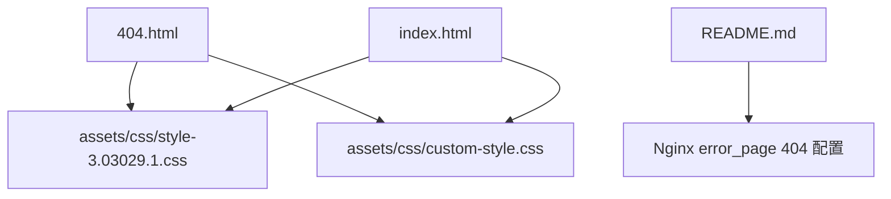
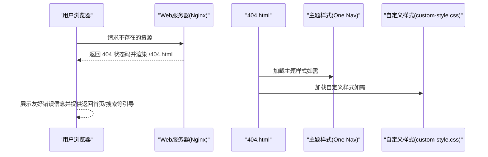
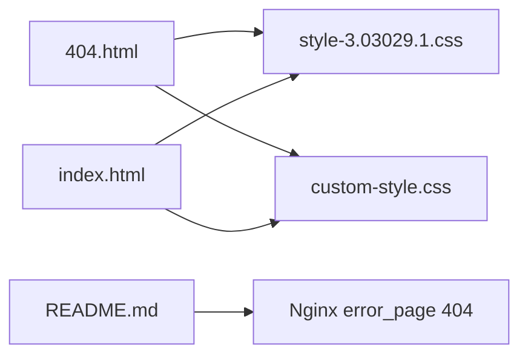

# 错误页面

<cite>
**本文引用的文件**
- [404.html](file://404.html)
- [index.html](file://index.html)
- [custom-style.css](file://assets/css/custom-style.css)
- [style-3.03029.1.css](file://assets/css/style-3.03029.1.css)
- [README.md](file://README.md)
</cite>

## 目录
1. [简介](#简介)
2. [项目结构](#项目结构)
3. [核心组件](#核心组件)
4. [架构总览](#架构总览)
5. [详细组件分析](#详细组件分析)
6. [依赖关系分析](#依赖关系分析)
7. [性能考虑](#性能考虑)
8. [故障排查指南](#故障排查指南)
9. [结论](#结论)
10. [附录](#附录)

## 简介
本文件围绕站点根目录下的 404.html 错误页面，系统阐述其设计理念、交互与样式实现、可访问性与 SEO 考量，以及如何在当前项目中对其进行自定义与优化。同时结合主站 index.html 的导航、搜索与主题样式，给出与主站风格一致性的建议与落地方案。

## 项目结构
- 404.html：站点级 404 错误页入口文件（当前为极简文本提示）
- index.html：主站首页，包含导航、搜索、主题样式引用等
- assets/css/custom-style.css：站点自定义样式
- assets/css/style-3.03029.1.css：主题基础样式（One Nav），提供全局布局、响应式、主题切换等能力
- README.md：部署说明中包含 Nginx 的 404 页面配置示例

图表来源
- [404.html:1-3](file://404.html#L1-L3)
- [index.html:17-31](file://index.html#L17-L31)
- [custom-style.css:1-126](file://assets/css/custom-style.css#L1-L126)
- [style-3.03029.1.css:1-200](file://assets/css/style-3.03029.1.css#L1-L200)
- [README.md:86-116](file://README.md#L86-L116)

章节来源
- [404.html:1-3](file://404.html#L1-L3)
- [index.html:1-35](file://index.html#L1-L35)
- [custom-style.css:1-126](file://assets/css/custom-style.css#L1-L126)
- [style-3.03029.1.css:1-200](file://assets/css/style-3.03029.1.css#L1-L200)
- [README.md:86-116](file://README.md#L86-L116)

## 核心组件
- 404 页面主体：当前仅包含一行错误提示文本，未引入任何样式或脚本
- 主题样式：通过 index.html 引入的主题 CSS 提供统一的字体、颜色、布局与响应式能力
- 自定义样式：custom-style.css 提供站点级覆盖，如网格背景、搜索框样式等
- 部署配置：README.md 中提供了 Nginx 将 404 请求重定向到 /404.html 的配置片段

章节来源
- [404.html:1-3](file://404.html#L1-L3)
- [index.html:17-31](file://index.html#L17-L31)
- [custom-style.css:1-126](file://assets/css/custom-style.css#L1-L126)
- [README.md:86-116](file://README.md#L86-L116)

## 架构总览
从用户访问到错误页展示的端到端流程如下：

图表来源
- [README.md:86-116](file://README.md#L86-L116)
- [404.html:1-3](file://404.html#L1-L3)
- [index.html:17-31](file://index.html#L17-L31)

## 详细组件分析

### 404.html 设计与现状
- 现状：仅包含一段纯文本“找不到页面（404 not found）”，无标题、无 meta、无样式、无交互
- 问题：
  - 缺少语义化标签与元信息，不利于 SEO 与可访问性
  - 无返回首页、搜索、分类导航等用户引导
  - 未复用主站主题样式，视觉不一致
- 改进方向：
  - 增加完整的 HTML 骨架、title、meta 描述与关键词
  - 引入主题 CSS，保持与主站一致的字体、配色、响应式
  - 添加返回首页按钮、站内搜索入口、常用分类快捷链接
  - 使用图标库（Font Awesome）增强可视化
  - 补充无障碍属性（aria-label、role 等）

章节来源
- [404.html:1-3](file://404.html#L1-L3)
- [index.html:17-31](file://index.html#L17-L31)
- [style-3.03029.1.css:1-200](file://assets/css/style-3.03029.1.css#L1-L200)

### 与主站风格的一致性
- 主题样式：One Nav 主题提供全局字体、颜色、间距、响应式断点与暗色模式支持
- 自定义样式：custom-style.css 定义了网格背景、搜索热词样式、导航颜色等
- 建议：
  - 在 404.html 中引入 style-3.03029.1.css 与 custom-style.css，确保与主站一致
  - 复用主站的图标库（Font Awesome）与 Bootstrap 类名，减少重复开发
  - 使用主站已有的颜色变量与字号体系，保证视觉统一

章节来源
- [index.html:17-31](file://index.html#L17-L31)
- [custom-style.css:1-126](file://assets/css/custom-style.css#L1-L126)
- [style-3.03029.1.css:1-200](file://assets/css/style-3.03029.1.css#L1-L200)

### 交互设计：错误提示、导航与搜索集成
- 错误提示：清晰告知用户当前状态（404），避免技术术语堆砌
- 导航选项：
  - 返回首页：提供显眼的“返回首页”按钮
  - 常用分类：列出“常用工具”“科研办公”“悠闲娱乐”“素材资源”“开发设计”“资讯学习”等分类入口，帮助用户快速定位
- 搜索功能：
  - 集成主站搜索表单，支持多搜索引擎（百度、必应、谷歌等）
  - 提供搜索占位提示与快捷键（如 Enter 提交）
- 可访问性：
  - 为按钮和链接添加 aria-label
  - 确保键盘可达与焦点可见

章节来源
- [index.html:245-326](file://index.html#L245-L326)
- [index.html:334-571](file://index.html#L334-L571)
- [index.html:580-588](file://index.html#L580-L588)

### 样式设计：响应式与动画
- 响应式：基于 Bootstrap 栅格与媒体查询，适配移动端与桌面端
- 动画：
  - 卡片悬停上浮与阴影效果（参考 url-card 样式）
  - 搜索热词下拉与高亮
- 建议：
  - 在 404 页面加入适度动效（如按钮 hover 反馈、淡入提示），提升体验但不影响性能
  - 遵循主站配色与圆角、阴影规范

章节来源
- [style-3.03029.1.css:189-200](file://assets/css/style-3.03029.1.css#L189-L200)
- [custom-style.css:45-77](file://assets/css/custom-style.css#L45-L77)

### 如何自定义 404 页面
- 修改错误信息：
  - 更新 404.html 中的提示文案，使其更友好且符合品牌调性
- 添加品牌元素：
  - 引入站点 Logo、品牌色、字体与图标库
- 集成搜索功能：
  - 复制主站搜索表单结构，设置 action 与 input 占位符
- 添加导航选项：
  - 插入“返回首页”“常用分类”“关于”等链接
- 保持一致性：
  - 引用主题 CSS 与自定义 CSS，复用 Bootstrap 与 Font Awesome

章节来源
- [index.html:17-31](file://index.html#L17-L31)
- [index.html:334-571](file://index.html#L334-L571)
- [custom-style.css:1-126](file://assets/css/custom-style.css#L1-L126)

### 用户体验优化建议
- 错误恢复路径：
  - 提供“返回首页”“回到上次浏览”（若可用）“站内搜索”等多条恢复路径
- 用户引导策略：
  - 使用清晰的文案与图标，降低理解成本
  - 根据用户可能意图推荐热门分类或工具
- 品牌一致性维护：
  - 沿用主站配色、字体、间距与动效规范
  - 保持文案语气与品牌调性一致

[本节为通用建议，不直接分析具体文件]

### SEO 友好性与可访问性
- SEO：
  - 设置合适的 title、meta description、keywords
  - 使用语义化标签（h1/h2、p、a）
  - 提供结构化数据（可选）
- 可访问性：
  - 为所有交互元素添加 aria-label
  - 确保键盘可达与焦点可见
  - 图片与图标提供 alt 或 aria-hidden

章节来源
- [index.html:7-15](file://index.html#L7-L15)
- [style-3.03029.1.css:47-51](file://assets/css/style-3.03029.1.css#L47-L51)

## 依赖关系分析
- 404.html 当前未引入任何外部资源；建议引入主题 CSS 与自定义 CSS，以复用主站样式
- 主站 index.html 已引入 Bootstrap、Font Awesome、主题样式与自定义样式，可作为 404 页面的样式依赖参考
- 部署层依赖 Nginx 配置将 404 请求正确路由到 404.html

图表来源
- [404.html:1-3](file://404.html#L1-L3)
- [index.html:17-31](file://index.html#L17-L31)
- [custom-style.css:1-126](file://assets/css/custom-style.css#L1-L126)
- [style-3.03029.1.css:1-200](file://assets/css/style-3.03029.1.css#L1-L200)
- [README.md:86-116](file://README.md#L86-L116)

章节来源
- [index.html:17-31](file://index.html#L17-L31)
- [custom-style.css:1-126](file://assets/css/custom-style.css#L1-L126)
- [style-3.03029.1.css:1-200](file://assets/css/style-3.03029.1.css#L1-L200)
- [README.md:86-116](file://README.md#L86-L116)

## 性能考虑
- 最小化资源：仅在 404.html 引入必要的 CSS，避免加载完整主站 JS
- 缓存策略：静态资源启用长期缓存（参考 README 中的 Nginx 配置）
- 首屏优化：优先加载关键 CSS，延迟非关键脚本
- 动画克制：避免复杂动画导致卡顿，使用轻量过渡

[本节为通用指导，不直接分析具体文件]

## 故障排查指南
- 404 页面未生效：
  - 检查 Nginx 是否配置了 error_page 404 /404.html
  - 确认 404.html 路径与权限正确
- 样式未加载：
  - 检查 CSS 路径是否正确引用
  - 确认浏览器控制台无 404 资源报错
- 搜索无法使用：
  - 检查 form action 与输入框 name/value 是否正确
  - 确认第三方搜索服务地址可用

章节来源
- [README.md:86-116](file://README.md#L86-L116)
- [index.html:334-571](file://index.html#L334-L571)

## 结论
当前 404.html 为极简文本提示，尚未与主站风格与交互保持一致。建议引入主题与自定义样式，完善语义化与元信息，增加返回首页、搜索与常用分类导航，提升用户体验、SEO 与可访问性。同时确保部署层正确配置 404 路由，保障错误场景下的稳定呈现。

[本节为总结性内容，不直接分析具体文件]

## 附录
- 部署参考：Nginx 中 404 页面配置示例见 README 对应段落
- 主题与样式：One Nav 主题与自定义样式文件位于 assets/css 目录
- 主站导航与搜索：参考 index.html 中的结构与类名，便于在 404 页面复用

章节来源
- [README.md:86-116](file://README.md#L86-L116)
- [index.html:245-326](file://index.html#L245-L326)
- [index.html:334-571](file://index.html#L334-L571)