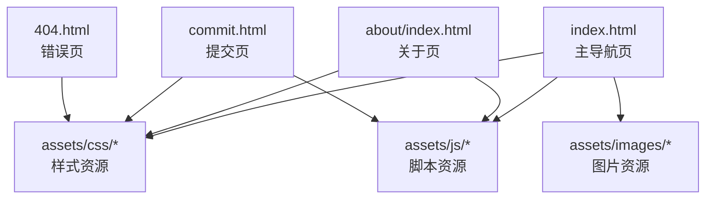
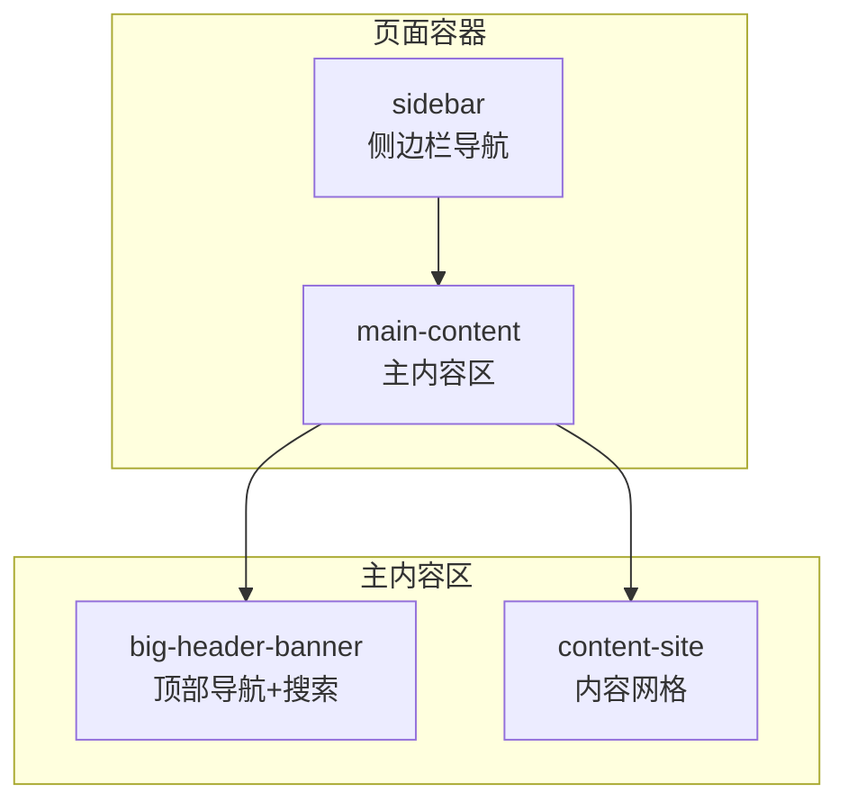
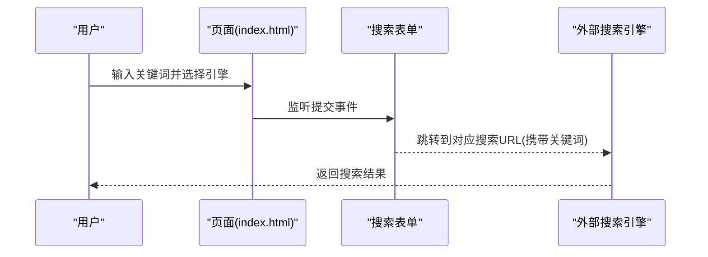
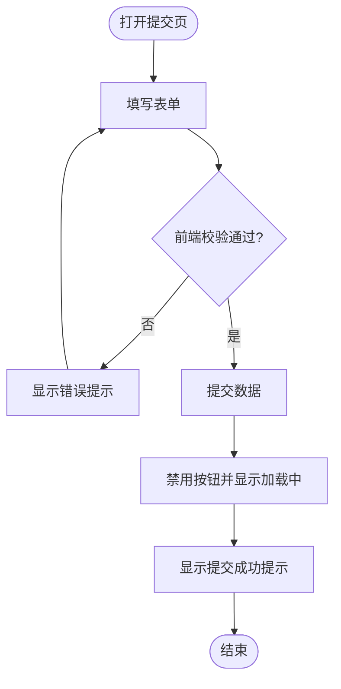
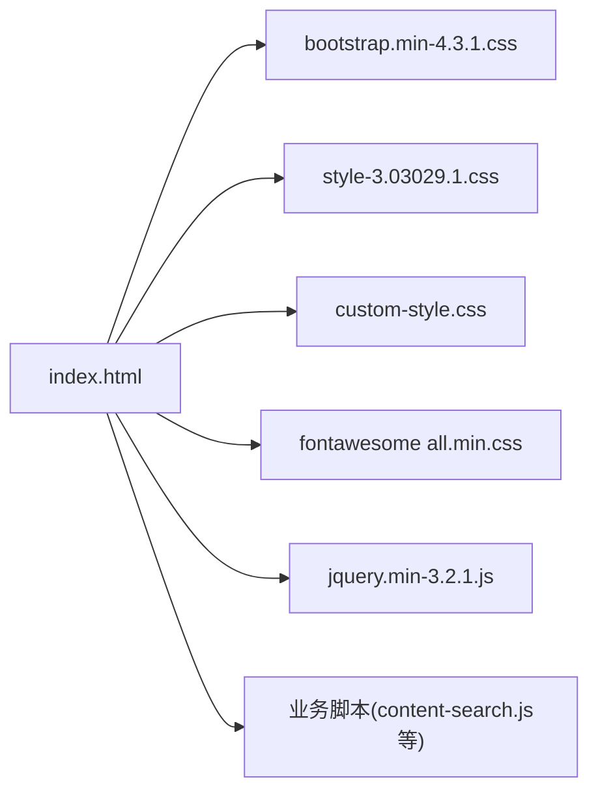

# 页面结构

<cite>
**本文引用的文件**
- [index.html](file://index.html)
- [about/index.html](file://about/index.html)
- [commit.html](file://commit.html)
- [404.html](file://404.html)
- [README.md](file://README.md)
- [assets/css/custom-style.css](file://assets/css/custom-style.css)
</cite>

## 目录
1. [简介](#简介)
2. [项目结构](#项目结构)
3. [核心组件](#核心组件)
4. [架构总览](#架构总览)
5. [详细组件分析](#详细组件分析)
6. [依赖关系分析](#依赖关系分析)
7. [性能与优化建议](#性能与优化建议)
8. [故障排查指南](#故障排查指南)
9. [结论](#结论)
10. [附录：页面定制与扩展指南](#附录页面定制与扩展指南)

## 简介
本项目是一个纯静态的在线网址导航站点，采用 HTML + CSS + JavaScript（jQuery）构建，具备响应式布局、分类导航、站内搜索、网站提交表单、关于页和 404 错误页等基础能力。整体以“单页多路由”的方式组织页面：首页 index.html 承载主要导航内容，about/index.html 为关于页，commit.html 为提交页，404.html 为未找到页面。样式基于 Bootstrap 4 与自定义主题，图标使用 Font Awesome，交互由 jQuery 驱动。

## 项目结构
- 根级页面
  - index.html：主入口，包含侧边栏导航、顶部搜索区、内容网格区域等
  - commit.html：网站提交表单页，含前端校验与交互
  - about/index.html：关于作者/团队信息页，独立样式与布局
  - 404.html：极简 404 提示页
- 资源目录 assets
  - css：Bootstrap、主题样式、自定义样式 custom-style.css
  - js：jQuery、第三方插件与业务脚本
  - images：站点图标与占位图
  - fontawesome-5.15.4：图标库资源

图表来源
- [index.html:1-35](file://index.html#L1-L35)
- [about/index.html:1-26](file://about/index.html#L1-L26)
- [commit.html:1-26](file://commit.html#L1-L26)
- [404.html:1-3](file://404.html#L1-L3)

章节来源
- [README.md:298-314](file://README.md#L298-L314)

## 核心组件
- 头部引入与元信息
  - 统一设置语言、视口、主题色、标题、关键词与描述，利于 SEO 与移动端适配
  - 引入 Bootstrap、主题样式、自定义样式、Font Awesome 与必要脚本
- 侧边栏导航
  - 左侧固定/可折叠菜单，按分类组织链接，支持子菜单展开
  - 底部提供“网站提交”“友情链接”“关于导航”等常用入口
- 顶部导航与搜索
  - 顶部导航包含“首页”“关于”等快捷入口
  - 集成天气小部件与每日一句
  - 搜索区支持多引擎切换（百度、必应、谷歌等），并带热词提示
- 内容区域
  - 以卡片网格展示各分类下的工具/资源链接，支持懒加载与悬停提示
- 底部信息
  - 通过全局样式控制页脚文本与链接样式

章节来源
- [index.html:1-35](file://index.html#L1-L35)
- [index.html:44-216](file://index.html#L44-L216)
- [index.html:219-331](file://index.html#L219-L331)
- [index.html:334-574](file://index.html#L334-L574)
- [index.html:577-800](file://index.html#L577-L800)
- [assets/css/custom-style.css:1-126](file://assets/css/custom-style.css#L1-L126)

## 架构总览
页面采用“容器 + 模块”的布局方式：page-container 包裹 sidebar 与 main-content；main-content 内部再分 big-header-banner（顶部导航+搜索）、content-site（内容网格）。各页面共享同一套资源与样式，通过相对路径引用，便于部署与维护。

图表来源
- [index.html:42-216](file://index.html#L42-L216)
- [index.html:219-331](file://index.html#L219-L331)
- [index.html:577-800](file://index.html#L577-L800)

## 详细组件分析

### 首页（index.html）
- 职责
  - 聚合所有分类与链接，提供快速检索与导航
  - 作为站点入口，承载品牌信息与基础交互
- 结构与实现要点
  - 头部 meta 与资源引入：统一风格与 SEO 基础
  - 侧边栏：多级分类菜单，支持平滑滚动与动态高亮
  - 顶部导航：站点内跳转、天气、每日一句、搜索弹窗
  - 搜索区：多搜索引擎切换、热词提示、回车提交
  - 内容区：卡片网格，懒加载图片，悬停显示描述
- 交互流程（搜索）

图表来源
- [index.html:334-574](file://index.html#L334-L574)

章节来源
- [index.html:1-35](file://index.html#L1-L35)
- [index.html:44-216](file://index.html#L44-L216)
- [index.html:219-331](file://index.html#L219-L331)
- [index.html:334-574](file://index.html#L334-L574)
- [index.html:577-800](file://index.html#L577-L800)

### 关于页（about/index.html）
- 职责
  - 展示作者/团队介绍、技术栈、工作理念与联系方式
- 结构与实现要点
  - 独立样式块，卡片式布局，响应式栅格
  - 使用图标增强可读性，提供返回首页按钮
- 可访问性与 SEO
  - 语义化标题与段落，alt 文本用于图片（如有）
  - 合理的标题层级与对比度

章节来源
- [about/index.html:1-26](file://about/index.html#L1-L26)
- [about/index.html:27-237](file://about/index.html#L27-L237)
- [about/index.html:244-338](file://about/index.html#L244-L338)

### 提交页（commit.html）
- 职责
  - 收集用户提交的网站信息，进行前端校验与提示
- 结构与实现要点
  - 表单字段：名称、地址、分类、描述、关键词、邮箱、联系方式
  - 前端校验：必填项、URL/邮箱格式、字数统计、错误提示
  - 交互：禁用提交按钮防重复提交，成功提示
- 数据流（提交）

图表来源
- [commit.html:27-175](file://commit.html#L27-L175)
- [commit.html:178-382](file://commit.html#L178-L382)

章节来源
- [commit.html:1-26](file://commit.html#L1-L26)
- [commit.html:27-175](file://commit.html#L27-L175)
- [commit.html:178-382](file://commit.html#L178-L382)

### 404 错误页（404.html）
- 职责
  - 当请求不存在时给出友好提示
- 实现
  - 极简文本提示，便于服务器配置 error_page 指向该文件

章节来源
- [404.html:1-3](file://404.html#L1-L3)

## 依赖关系分析
- 样式依赖
  - Bootstrap 4 提供栅格与基础组件
  - 主题样式 style-3.03029.1.css 定义整体视觉
  - custom-style.css 覆盖与增强局部样式（如网格背景、搜索热词、页脚等）
- 脚本依赖
  - jQuery 作为 DOM 操作与事件处理基础
  - 其他插件按需引入（如 fancybox、lozad 等）
- 资源路径
  - 页面通过相对路径引用 assets 下资源，保证本地预览与部署一致性

图表来源
- [index.html:17-31](file://index.html#L17-L31)
- [assets/css/custom-style.css:1-126](file://assets/css/custom-style.css#L1-L126)

章节来源
- [index.html:17-31](file://index.html#L17-L31)
- [assets/css/custom-style.css:1-126](file://assets/css/custom-style.css#L1-L126)

## 性能与优化建议
- 加载性能
  - 合并与压缩 CSS/JS，启用 Gzip/Brotli 压缩（参考 README 中 Nginx 配置）
  - 图片懒加载：已使用 lozad 类名，确保 data-src 正确
  - 缓存策略：对静态资源设置长期缓存头（见 README 示例）
- SEO 优化
  - 完善每个页面的 title、meta description、keywords
  - 添加 sitemap.xml 并提交搜索引擎
  - 合理使用语义化标签与 alt 文本
- 可访问性
  - 为图片提供 alt，为表单控件提供 label
  - 保持足够的颜色对比度，键盘可达性
- 交互体验
  - 避免阻塞渲染的同步脚本，将非关键脚本置于末尾或异步加载
  - 减少重排重绘，合理拆分大段 DOM 更新

章节来源
- [README.md:47-116](file://README.md#L47-L116)
- [index.html:17-31](file://index.html#L17-L31)
- [assets/css/custom-style.css:1-126](file://assets/css/custom-style.css#L1-L126)

## 故障排查指南
- 资源加载失败
  - 检查相对路径是否正确，确认 assets 目录结构与引用一致
  - 浏览器控制台查看网络请求状态码与跨域问题
- 搜索不生效
  - 确认搜索表单 action 与目标搜索引擎 URL 拼接正确
  - 检查是否被广告拦截器阻止了第三方脚本
- 提交表单无响应
  - 当前为前端演示逻辑，需接入后端 API 或第三方表单服务
  - 检查浏览器控制台是否有 JS 报错，确认事件绑定是否生效
- 404 页面未生效
  - 在服务器（如 Nginx）中配置 error_page 404 /404.html

章节来源
- [README.md:316-341](file://README.md#L316-L341)
- [commit.html:286-382](file://commit.html#L286-L382)

## 结论
本项目以简洁清晰的页面结构实现了导航站点的核心功能：首页聚合资源、搜索便捷、分类清晰；提交页提供友好的数据采集与校验；关于页与 404 页完善了用户体验。通过统一的资源管理与模块化样式，便于后续扩展与维护。建议在现有基础上继续推进性能优化、SEO 完善与可访问性提升。

## 附录：页面定制与扩展指南
- 新增分类与链接
  - 在 index.html 的内容区域复制现有卡片模板，修改链接、名称与描述
  - 在侧边栏对应分类下增加条目，确保锚点 ID 与内容区一致
- 修改导航与页眉
  - 调整顶部导航菜单项与顺序，可在 big-header-banner 内编辑
  - 如需更换主题或配色，优先在 custom-style.css 中覆盖
- 替换搜索引擎
  - 在搜索组中添加新的 radio 选项，设置 value 为目标搜索引擎 URL 模板
- 接入后端提交
  - 在 commit.html 中替换前端模拟逻辑，调用真实 API 或第三方表单服务
  - 注意跨域与安全策略（CORS、CSRF 等）
- 部署与发布
  - 推荐使用 Vercel/Cloudflare Pages/GitHub Pages 等静态托管平台
  - 配置 HTTPS 与自定义域名，开启缓存与压缩

章节来源
- [README.md:242-296](file://README.md#L242-L296)
- [index.html:577-800](file://index.html#L577-L800)
- [commit.html:286-382](file://commit.html#L286-L382)