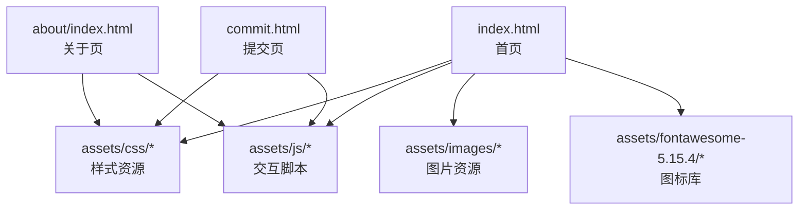
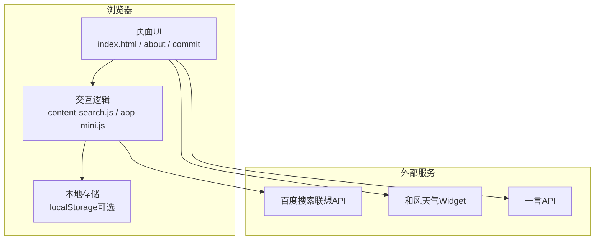
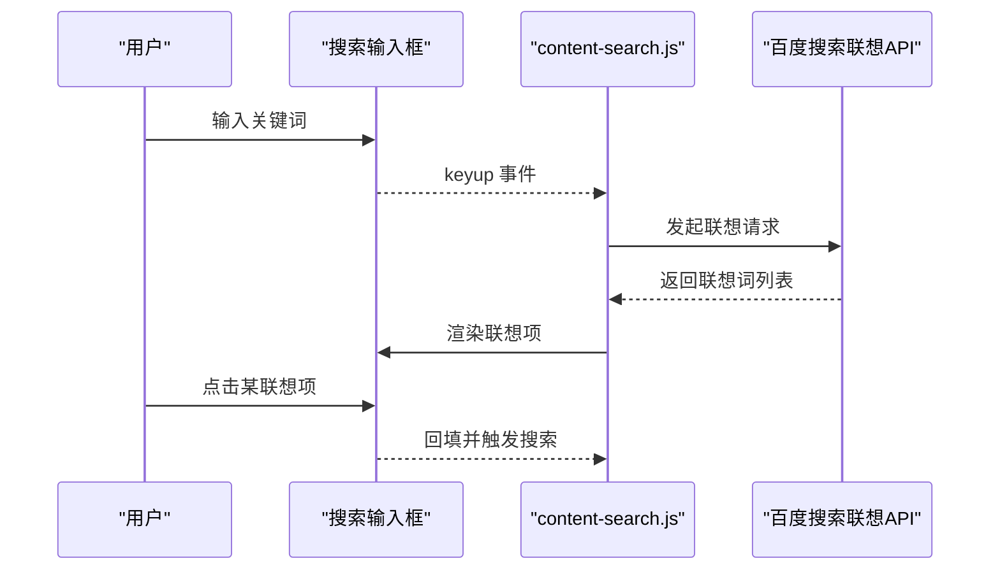
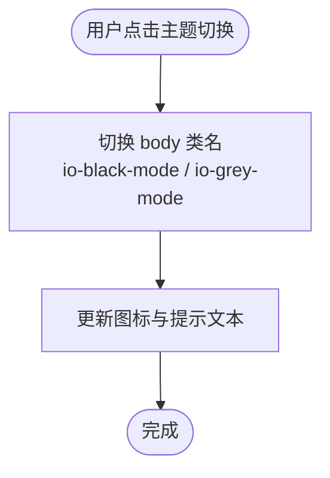
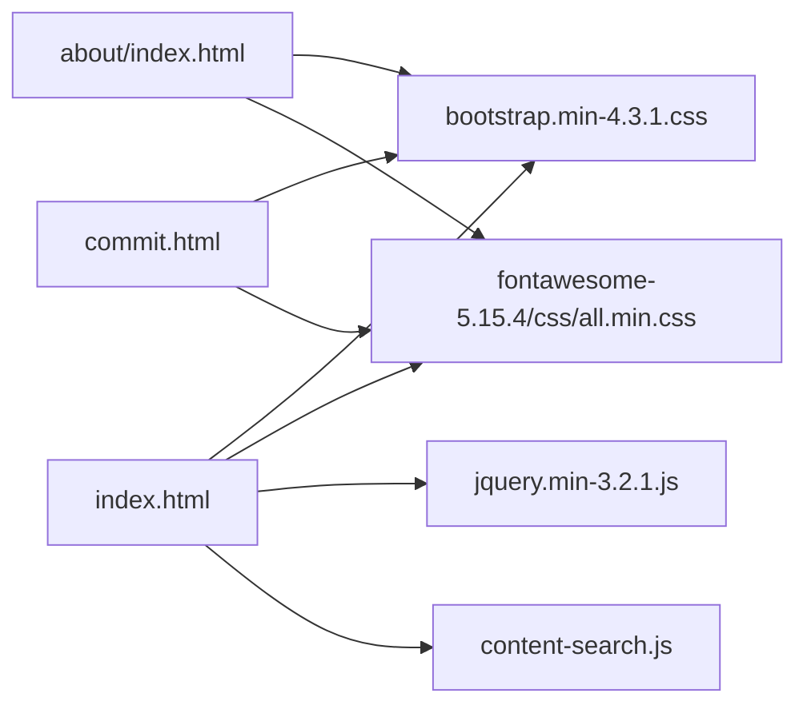

# 项目概述

<cite>
**本文引用的文件**
- [README.md](file://README.md)
- [index.html](file://index.html)
- [about/index.html](file://about/index.html)
- [commit.html](file://commit.html)
- [assets/js/content-search.js](file://assets/js/content-search.js)
- [assets/js/app-mini.js](file://assets/js/app-mini.js)
</cite>

## 目录
1. [简介](#简介)
2. [项目结构](#项目结构)
3. [核心组件](#核心组件)
4. [架构总览](#架构总览)
5. [详细组件分析](#详细组件分析)
6. [依赖关系分析](#依赖关系分析)
7. [性能与优化建议](#性能与优化建议)
8. [故障排查指南](#故障排查指南)
9. [结论](#结论)
10. [附录：快速开始与部署](#附录快速开始与部署)

## 简介
本项目是一个基于纯前端技术（HTML + CSS + JavaScript）构建的在线网址导航工具，无需后端即可运行。它提供响应式布局、主题切换（日间/夜间）、智能搜索、分类导航与网站提交等能力，适合个人或团队作为日常资源入口使用。项目采用静态站点形式，可轻松部署到 GitHub Pages、Vercel、Cloudflare Pages、Nginx 等多种环境。

## 项目结构
项目采用清晰的静态站点组织方式，主要包含首页、关于页、提交页以及统一的资源目录（样式、脚本、图片、图标库）。

图表来源
- [index.html:1-35](file://index.html#L1-L35)
- [about/index.html:1-26](file://about/index.html#L1-L26)
- [commit.html:1-26](file://commit.html#L1-L26)

章节来源
- [README.md:298-314](file://README.md#L298-L314)

## 核心组件
- 首页（index.html）：承载导航分类、网址卡片、顶部搜索栏、侧边栏导航、天气与一言展示等。
- 关于页（about/index.html）：介绍作者信息、技术栈、联系方式等。
- 提交页（commit.html）：提供网站提交流程的前端表单与校验提示。
- 智能搜索（content-search.js）：接入百度联想词接口，实现输入联想与快捷选择。
- 主题与交互（app-mini.js / app-anim.js）：实现日间/夜间模式切换、返回顶部等交互逻辑。

章节来源
- [index.html:42-577](file://index.html#L42-L577)
- [about/index.html:244-333](file://about/index.html#L244-L333)
- [commit.html:178-200](file://commit.html#L178-L200)
- [assets/js/content-search.js:1-91](file://assets/js/content-search.js#L1-L91)
- [assets/js/app-mini.js:201-253](file://assets/js/app-mini.js#L201-L253)

## 架构总览
整体为“纯前端静态站点”架构，浏览器直接加载 HTML/CSS/JS，通过第三方服务完成部分功能（如天气、一言、搜索联想），数据持久化默认使用浏览器本地存储或可选的后端 API。

图表来源
- [index.html:270-326](file://index.html#L270-L326)
- [assets/js/content-search.js:1-91](file://assets/js/content-search.js#L1-L91)
- [assets/js/app-mini.js:201-253](file://assets/js/app-mini.js#L201-L253)

## 详细组件分析

### 首页（index.html）
- 侧边栏导航：按“常用工具、科研办公、悠闲娱乐、素材资源、开发设计、资讯学习”等分组，支持展开/收起与平滑滚动定位。
- 内容区：以卡片网格展示各网址，含图标、名称、描述与直达链接。
- 顶部区域：集成天气插件与一言文案；提供全局搜索入口。
- 响应式：基于 Bootstrap 栅格与自定义样式，适配移动端与桌面端。

章节来源
- [index.html:44-216](file://index.html#L44-L216)
- [index.html:577-800](file://index.html#L577-L800)

### 智能搜索（content-search.js）
- 监听输入框按键事件，调用百度搜索联想接口获取热词列表。
- 动态渲染联想项，点击后回填搜索框并触发搜索。
- 空输入或无结果时隐藏联想面板，提升体验。

图表来源
- [assets/js/content-search.js:1-91](file://assets/js/content-search.js#L1-L91)

章节来源
- [assets/js/content-search.js:1-91](file://assets/js/content-search.js#L1-L91)

### 主题切换与交互（app-mini.js / app-anim.js）
- 夜间/日间模式切换：通过切换 body 类名与更新图标提示，实现主题切换。
- 返回顶部：滚动超过阈值显示按钮，点击平滑回到顶部。
- 这些交互在多个脚本中保持一致的实现逻辑，便于统一维护。

图表来源
- [assets/js/app-mini.js:201-253](file://assets/js/app-mini.js#L201-L253)

章节来源
- [assets/js/app-mini.js:201-253](file://assets/js/app-mini.js#L201-L253)

### 关于页（about/index.html）
- 展示作者简介、技术栈、工作理念与联系方式。
- 内嵌统计脚本（51.la），用于访问统计。
- 提供返回首页按钮，保持导航一致性。

章节来源
- [about/index.html:244-333](file://about/index.html#L244-L333)

### 提交页（commit.html）
- 提供网站提交表单，包含必填字段校验与成功提示。
- 当前版本将数据暂存于浏览器本地存储；如需持久化，可对接后端 API 或第三方表单服务。
- 提供提交须知与友好提示，提升用户体验。

章节来源
- [commit.html:178-200](file://commit.html#L178-L200)
- [README.md:261-275](file://README.md#L261-L275)

## 依赖关系分析
- 样式与框架：Bootstrap 4、自定义主题样式、Font Awesome 图标库。
- 脚本库：jQuery、Fancybox、懒加载、动画库等。
- 外部服务：天气 Widget、一言 API、百度搜索联想 API。
- 页面间引用：首页、关于页、提交页均引入公共样式与脚本，保证风格一致。

图表来源
- [index.html:17-31](file://index.html#L17-L31)
- [about/index.html:15-26](file://about/index.html#L15-L26)
- [commit.html:15-26](file://commit.html#L15-L26)

章节来源
- [index.html:17-31](file://index.html#L17-L31)
- [about/index.html:15-26](file://about/index.html#L15-L26)
- [commit.html:15-26](file://commit.html#L15-L26)

## 性能与优化建议
- 资源缓存：对静态资源启用强缓存与压缩（参考 Nginx 配置示例）。
- 图片优化：使用 WebP/AVIF 格式与懒加载减少首屏体积。
- 脚本按需加载：将非关键脚本延迟加载，缩短首屏时间。
- 外部服务降级：当天气或一言不可用时提供静默失败与回退文案。
- 主题切换：避免频繁重绘，批量更新 DOM 与类名。

[本节为通用指导，不直接分析具体文件]

## 故障排查指南
- 图片或样式加载失败：检查相对路径是否正确，确保资源目录结构与引用一致。
- 搜索联想不生效：确认网络可达且未拦截跨域请求；查看控制台错误日志。
- 主题切换无效：检查是否引入了相关脚本，确认 body 类名切换逻辑未被覆盖。
- 提交功能无响应：若需持久化，请替换为真实后端 API 或第三方表单服务；否则数据仅保存在本地。

章节来源
- [README.md:316-341](file://README.md#L316-L341)
- [assets/js/content-search.js:1-91](file://assets/js/content-search.js#L1-L91)
- [assets/js/app-mini.js:201-253](file://assets/js/app-mini.js#L201-L253)

## 结论
该项目以纯前端技术实现了简洁美观、易于部署的在线网址导航工具。其核心优势在于零后端依赖、响应式设计与丰富的交互体验。通过合理的资源组织与模块化脚本，用户可以快速上手并进行二次定制。推荐用于个人知识管理、团队资源门户或开源项目导航。

[本节为总结性内容，不直接分析具体文件]

## 附录：快速开始与部署
- 本地预览：克隆仓库后，使用任意 HTTP 服务器启动或直接打开 index.html。
- 部署方式：支持 Nginx、GitHub Pages、Vercel、Cloudflare Pages、Netlify 等。
- 二次开发：修改 index.html 中的分类与链接；编辑 about/index.html 更新关于信息；在 commit.html 中配置提交逻辑。

章节来源
- [README.md:22-43](file://README.md#L22-L43)
- [README.md:45-241](file://README.md#L45-L241)
- [README.md:242-296](file://README.md#L242-L296)